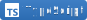
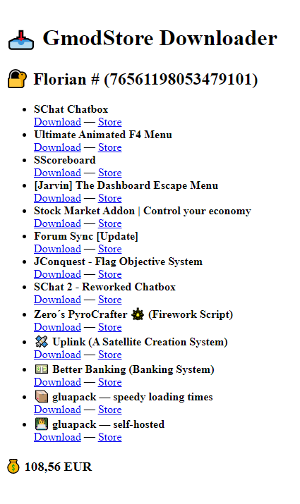

# 📥 GmodStore Downloader

## In French

### Introduction

Ce petit site Internet permet de télécharger des addons depuis le [GmodStore](https://www.gmodstore.com/) sans passer par l’interface en ligne, mais en s'appuyant sur son [API](https://docs.pivity.com/). Cette solution est particulièrement utile lorsqu'un propriétaire de compte souhaite offrir à des tiers la possibilité de télécharger ses addons créés ou achetés, sans leur communiquer ses identifiants de connexion. C'est une alternative sécurisée aux « **accès secondaires** ». Le propriétaire doit simplement générer un jeton d'accès avec des permissions limitées, qu'il pourra ensuite partager avec les personnes autorisées.

Les jetons peuvent être générés à cette adresse : https://www.gmodstore.com/settings/personal-access-tokens. Ils doivent comporter les autorisations suivantes : `products:read`, `product-versions:read`, `product-versions:download`, `users:read` et `user-purchases:read`. Une fois créés, le site Internet vous indique la démarche à suivre.

Auparavant, ce projet était développé en [PHP](https://www.php.net/) 🐘 (disponible via la branche `no-svelte`), car l'API GmodStore avait restreint les [en-têtes CORS](https://developer.mozilla.org/fr/docs/Web/HTTP/Guides/CORS), empêchant toute communication directe depuis un navigateur. Depuis, cette restriction a été levée, ce qui permet désormais d'utiliser le *framework* [Svelte](https://svelte.dev/) 🔥 pour interagir **directement** avec leur API. Cette migration a supprimé la nécessité d'un serveur intermédiaire, améliorant ainsi la confidentialité des données en exécutant l'**intégralité** du site Internet côté client, tout en optimisant ses performances.

> [!IMPORTANT]
> L'entièreté du code de ce projet est commenté dans ma langue natale (en français) et n'est pas voué à être traduit en anglais par soucis de simplicité de développement.

### Installation

> [!WARNING]
> Le déploiement en environnement de production nécessite un serveur Web déjà configuré comme [Nginx](https://nginx.org/en/), [Apache](https://httpd.apache.org/) ou [Caddy](https://caddyserver.com/) pour servir les fichiers statiques générés par Vite.

#### Développement local

- Installer [NodeJS LTS](https://nodejs.org/) (>20 ou plus) ;
- Installer les dépendances du projet avec la commande `npm install` ;
- Démarrer le serveur local Vite avec la commande `npm run dev`.

#### Déploiement en production

- Installer [NodeJS LTS](https://nodejs.org/) (>20 ou plus) ;
- Installer les dépendances du projet avec la commande `npm install` ;
- Compiler les fichiers statiques du site Internet avec la commande `npm run build` ;
- Utiliser un serveur Web pour servir les fichiers statiques générés à l'étape précédente.

> [!TIP]
> Pour tester le projet, vous *pouvez* également utiliser [Docker](https://www.docker.com/). Une fois installé, il suffit de lancer l'image Docker de développement à l'aide de la commande `docker compose up --detach --build`. Le site devrait être accessible à l'adresse suivante : http://localhost:5173/. Si vous souhaitez travailler sur le projet avec Docker, vous devez utiliser la commande `docker compose watch --no-up` pour que vos changements locaux soient automatiquement synchronisés avec le conteneur. 🐳

> [!CAUTION]
> L'image Docker **ne peut pas** et **n'a pas été conçue** pour fonctionner dans un environnement de production. Ce projet génère des fichiers statiques que **vous devez** servir avec un serveur Web déjà configuré et respectant aux bonnes pratiques de sécurité et d'optimisation. ⚠️

*Ce site Internet n'est en aucun cas affilié à GmodStore, à l'exception du fait que j'utilise leur formidable API pour vous fournir ce service.*

## In English

### Introduction

This small website lets you download addons from the [GmodStore](https://www.gmodstore.com/) without using the online interface, but by relying on its [API](https://docs.pivity.com/). This is particularly useful when an account owner wants to offer third parties a way to download created or purchased addons, without providing personal credentials. It's a secure alternative to "**secondary access**". The owner simply needs to generate an access token with limited permissions, which can then be shared with authorized persons.

Tokens can be generated at this address: https://www.gmodstore.com/settings/personal-access-tokens. They must have the following permissions: `products:read`, `product-versions:read`, `product-versions:download`, `users:read` and `user-purchases:read`. Once created, the website tells you what to do.

Previously, this project was developed in [PHP](https://www.php.net/) 🐘 (available through the `no-svelte` branch), because the GmodStore API restricted [CORS headers](https://developer.mozilla.org/fr/docs/Web/HTTP/Guides/CORS), preventing direct communication from a browser. This restriction has since been removed, allowing usage of [Svelte](https://svelte.dev/) 🔥 framework to communicate **directly** with their API. This migration has eliminated need for an intermediary server, improving data privacy by running the **entire** website client-side, while optimizing its performance.

> [!IMPORTANT]
> The whole code of this project is commented in my native language (in French) and will not be translated in English for easier programming.

### Setup

> [!WARNING]
> Deployment in a production environment requires a pre-configured web server such as [Nginx](https://nginx.org/en/), [Apache](https://httpd.apache.org/), or [Caddy](https://caddyserver.com/) to serve the static files generated by Vite.

#### Local development

- Install [NodeJS LTS](https://nodejs.org/) (>20 or higher) ;
- Install project dependencies using `npm install` ;
- Start Vite local server using `npm run dev`.

#### Production deployment

- Install [NodeJS LTS](https://nodejs.org/) (>20 or higher) ;
- Install project dependencies using `npm install` ;
- Build static website files using `npm run build` ;
- Remove development dependencies using `npm prune --omit=dev` ;
- Use a web server to serve the static files generated in the previous step.

> [!TIP]
> To try the project, you *can* also use [Docker](https://www.docker.com/) installed. Once installed, simply start the development Docker image with `docker compose up --detach --build` command. The website should be available at http://localhost:5173/. If you want to work on the project with Docker, you need to use `docker compose watch --no-up` to automatically synchronize your local changes with the container. 🐳

> [!CAUTION]
> The Docker image **cannot** and **was not designed** to run in a production environment. This project generates static files that must be served with a pre-configured web server adhering to security and optimization best practices. ⚠️

*This website is in no way affiliated with GmodStore, except that I use their amazing API to provide you this service.*

